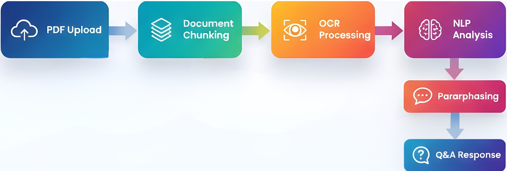

# DocuLix: Legal Document AI Platform

🧠 LLM-powered RAG system for legal document understanding  

<div align="center" style="margin-bottom: 20px;">
  
  
  
  
  
  
</div>

## 📊 Impact
- Processes **1K+ documents/day**
- Achieves **92% clause extraction accuracy**
- Reduces legal review time by **60%**

## 🧾 Overview
DocuLix is an AI-powered legal document analysis platform that automates the process of understanding complex contracts. It allows users to upload PDF, Word, or image-based documents and receive plain-language insights, risk analysis, and answers to legal queries.

The system combines a Next.js/React frontend, a Flask-based Python backend for document processing and NLP inference, and a Node.js authentication server with OTP verification and MongoDB integration. It leverages transformer-based models for clause extraction, paraphrasing, and question answering, along with sentiment analysis to identify risks in legal documents.

The platform is built using datasets such as SQuAD and CUAD to improve reading comprehension and contract understanding, and incorporates a T5-based paraphrasing model to simplify complex legal language. Additional NLP techniques, including sentiment analysis with TextBlob, help evaluate the implications of contract clauses.

DocuLix focuses on retrieval-based question answering, structured document analysis pipelines, and real-time interaction, enabling users to extract insights quickly and make informed decisions. The entire system is containerized using Docker, ensuring scalable and seamless deployment.

<div align="center">
  
  
  <br/>
  
  
  <br/>
  
  	
  <br/>
  
  
</div>

---

## 🏗️ Architecture


<div align="center">
  
</div>

---

## ✨ Key Features
- 📄 Multi-format uploads (PDF, Word, Images)
- 🤖 AI-powered legal Q&A using NLP models
- 🧠 Clause paraphrasing with T5-based models
- ⚖️ Risk & sentiment analysis of contract clauses
- 🔐 Secure OTP-based authentication
- ⏳ Configurable session timer with automatic logout (10-minute default) for secure access control
- 📜 Session history tracking to review previous queries and responses
- 📥 One-click download of complete session reports as PDF
- 🛡️ Your document is 100% secure — no user data or uploaded documents are stored
- ⚡ Modern dashboard with Next.js & React
- 🐳 Dockerized deployment using Docker Compose

## Components

### 1. Web App (Next.js/React)
- Modern dashboard UI
- File upload (PDF, Word, Images)
- AI-powered Q&A and document simplification
- Golden theme, typewriter animation, responsive design
- Auth integration (Sign Up, OTP, Sign In, Sign Out)

### 2. Flask Server (Python)
- `/upload-pdf`: Upload and process documents
- `/ask-question`: AI Q&A on uploaded docs
- `/validate-document`: Document type/structure validation
- OCR for images, PDF/Word parsing, paraphrasing
- CORS enabled for frontend integration

### 3. Node.js Auth Server
- User registration, login, OTP via Twilio/email
- MongoDB for user data
- EJS templates for forms
- Multer for form parsing

---

## Setup Instructions

### Prerequisites
- Node.js (v18+ recommended)
- Python 3.8+
- MongoDB (local or cloud)
- pip (Python package manager)

### 1. Install Python Dependencies
```bash
cd flask_server
pip install -r requirements.txt
```

### 2. Install Node.js Dependencies
```bash
cd "Sign Up"
npm install
cd ../web_app
npm install
```

### 3. Environment Variables
- Copy `.env.example` to `.env` in both `Sign Up` and `flask_server` folders
- Set MongoDB URI, Twilio, and email credentials as needed

### 4. Run Servers
- **Flask API:**
	```bash
	cd flask_server
	python app.py
	```
- **Node.js Auth:**
	```bash
	cd "Sign Up"
	node app.js
	```
- **Next.js Web App:**
	```bash
	cd web_app
	npm run dev
	```

---

## Usage
- Visit [http://localhost:3000](http://localhost:3000) for the web dashboard
- Upload a document, ask questions, or paraphrase content
- Sign up/sign in with OTP verification

---

## File Structure
```
Legal-AI_Project/
├── flask_server/         # Python Flask backend
│   ├── app.py
│   ├── requirements.txt
│   └── ...
├── Sign Up/              # Node.js/Express auth server
│   ├── app.js
│   ├── controllers/
│   ├── models/
│   └── ...
├── web_app/              # Next.js/React frontend
│   ├── pages/
│   ├── components/
│   ├── styles/
│   └── ...
└── README.md
```

---

## Support
For any questions, issues, or feedback, please contact: [soumitra.ghosh468@gmail.com](mailto:soumitra.ghosh468@gmail.com) 

## Acknowledgments
We would like to acknowledge the following open-source projects and datasets that have contributed to the development of our platform:

- Next.js: [Link to Next.js GitHub repository](https://github.com/vercel/next.js)
- SQuAD Dataset: [Link to SQuAD dataset](https://rajpurkar.github.io/SQuAD-explorer/)
- T5-base Model: [Link to T5-base model](https://huggingface.co/t5-base)
- Flask: [Link to Flask documentation](https://flask.palletsprojects.com/)
- TextBlob: [Link to TextBlob documentation](https://textblob.readthedocs.io/)

## Disclaimer
The Automated Legal Document Analysis Platform is intended to assist users in understanding legal documents and potential risks. However, it should not be considered a substitute for professional legal advice. Users are encouraged to consult with legal professionals before making any legal decisions or signing contracts.
