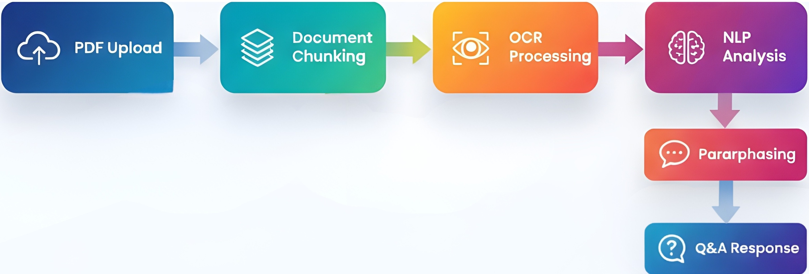

# DocuLix: Legal Document AI Platform


## Overview
DocuLix is an AI-powered platform for uploading, analyzing, and simplifying legal documents. It features a modern web dashboard (Next.js/React), a Python Flask backend for document processing, and a Node.js/Express authentication server with OTP verification. The system supports PDF, Word, and image uploads, and provides plain-language answers to legal questions.

<div align="center">
  
  
  <br/>
  
  
</div>

---

## FlowChart


<div align="center">
  
</div>

---

## Components

### 1. Web App (Next.js/React)
- Modern dashboard UI
- File upload (PDF, Word, Images)
- AI-powered Q&A and document simplification
- Golden theme, typewriter animation, responsive design
- Auth integration (Sign Up, OTP, Sign In, Sign Out)

### 2. Flask Server (Python)
- `/upload-pdf`: Upload and process documents
- `/ask-question`: AI Q&A on uploaded docs
- `/validate-document`: Document type/structure validation
- OCR for images, PDF/Word parsing, paraphrasing
- CORS enabled for frontend integration

### 3. Node.js Auth Server
- User registration, login, OTP via Twilio/email
- MongoDB for user data
- EJS templates for forms
- Multer for form parsing

---

## Setup Instructions

### Prerequisites
- Node.js (v18+ recommended)
- Python 3.8+
- MongoDB (local or cloud)
- pip (Python package manager)

### 1. Install Python Dependencies
```bash
cd flask_server
pip install -r requirements.txt
```

### 2. Install Node.js Dependencies
```bash
cd "Sign Up"
npm install
cd ../web_app
npm install
```

### 3. Environment Variables
- Copy `.env.example` to `.env` in both `Sign Up` and `flask_server` folders
- Set MongoDB URI, Twilio, and email credentials as needed

### 4. Run Servers
- **Flask API:**
	```bash
	cd flask_server
	python app.py
	```
- **Node.js Auth:**
	```bash
	cd "Sign Up"
	node app.js
	```
- **Next.js Web App:**
	```bash
	cd web_app
	npm run dev
	```

---

## Usage
- Visit [http://localhost:3000](http://localhost:3000) for the web dashboard
- Upload a document, ask questions, or paraphrase content
- Sign up/sign in with OTP verification

---

## File Structure
```
Legal-AI_Project/
├── flask_server/         # Python Flask backend
│   ├── app.py
│   ├── requirements.txt
│   └── ...
├── Sign Up/              # Node.js/Express auth server
│   ├── app.js
│   ├── controllers/
│   ├── models/
│   └── ...
├── web_app/              # Next.js/React frontend
│   ├── pages/
│   ├── components/
│   ├── styles/
│   └── ...
└── README.md
```

---

## Authors
- Team DocuLix

# Legal AI :Automated Legal Document Analysis Platform

<div align="center" style="margin-bottom: 20px;">
		
		
	
	
	
	
</div>

## Overview
The Automated Legal Document Analysis Platform is a powerful web application that automates the laborious process of analyzing legal documents. By leveraging cutting-edge technologies such as Next.js, NLP, and machine learning models, our platform extracts relevant information and identifies potential risks from legal documents. It empowers users to understand complex contract clauses, avoid potential losses, and make informed decisions when signing contracts.

## Key Features
-**Automated Document Analysis**: Our platform streamlines the manual process of analyzing legal documents, saving time and effort.
-**Reading Comprehension Model**: We have developed and evaluated a reading comprehension model based on the SQuAD dataset, allowing users to extract information directly from the documents.
-**CUAD Dataset**: To address critical clauses commonly asked by people and lawyers, we created a CUAD dataset consisting of 500 contracts in the form of question responses.
-**Paraphrasing Model**: We integrate a paraphrasing model based on the T5-base model. This model utilizes datasets from Quora, SQuAD 2.0, and the CNN news dataset, enabling users to better understand contract clauses.
-**Sentiment Analysis**: Our platform includes a sentiment analysis model powered by TextBlob, which provides insights into the impact and implications of contract clauses.
-**User-Friendly Interface**: We have developed a user-friendly interface using Next.js, ensuring a seamless and intuitive user experience.
-**Flask Server Integration**: The web interface connects seamlessly to the machine learning side through a Flask server, enabling efficient data processing and analysis.
-**Docker Containerization**: To simplify deployment, we have containerized our application using Docker. Users can run the application effortlessly by executing Docker Compose.

## Getting Started
To get started with the Automated Legal Document Analysis Platform, follow these steps:

1. Clone the repository from GitHub.
2. Navigate to the web  directory.
3. Install the necessary dependencies using `npm install`.
4. Start the development server using `npm run dev`.
5. Navigate to the flask directory.
6. Install the flask dependencies using `pip install flask`.
7. Start flask server using `flask run`.
8. Access the web application through your browser.

Alternatively, if you prefer to use Docker:

1. Install Docker on your system.
2. Navigate to the project directory.
3. Execute `docker-compose up` to start the application.
4. Access the web application through your browser.

## Technology Stack
The Automated Legal Document Analysis Platform is built on the following technologies:

- **Next.js**: A popular React framework for building user interfaces.
- **NLP**: Natural Language Processing techniques are utilized to extract information and generate paraphrases.
- **SQuAD Dataset**: The SQuAD dataset is used to develop and evaluate our reading comprehension model.
- **CUAD Dataset**: The CUAD dataset, comprising 500 contracts, is utilized to address critical clauses commonly asked by users and legal professionals.
- **T5-base Model**: Our paraphrasing model is based on the T5-base model, which facilitates the generation of high-quality paraphrases.
- **Flask**: A Python micro web framework used to connect the user interface with the machine learning side.
- **TextBlob**: A Python library for NLP tasks such as sentiment analysis, which we employ to analyze the impact of contract clauses.
- **Docker**: Containerization technology used to package the application and simplify deployment.


## Support
For any questions, issues, or feedback, please contact our  team 

## Acknowledgments
We would like to acknowledge the following open-source projects and datasets that have contributed to the development of our platform:

- Next.js: [Link to Next.js GitHub repository](https://github.com/vercel/next.js)
- SQuAD Dataset: [Link to SQuAD dataset](https://rajpurkar.github.io/SQuAD-explorer/)
- T5-base Model: [Link to T5-base model](https://huggingface.co/t5-base)
- Flask: [Link to Flask documentation](https://flask.palletsprojects.com/)
- TextBlob: [Link to TextBlob documentation](https://textblob.readthedocs.io/)

## Disclaimer
The Automated Legal Document Analysis Platform is intended to assist users in understanding legal documents and potential risks. However, it should not be considered a substitute for professional legal advice. Users are encouraged to consult with legal professionals before making any legal decisions or signing contracts.
